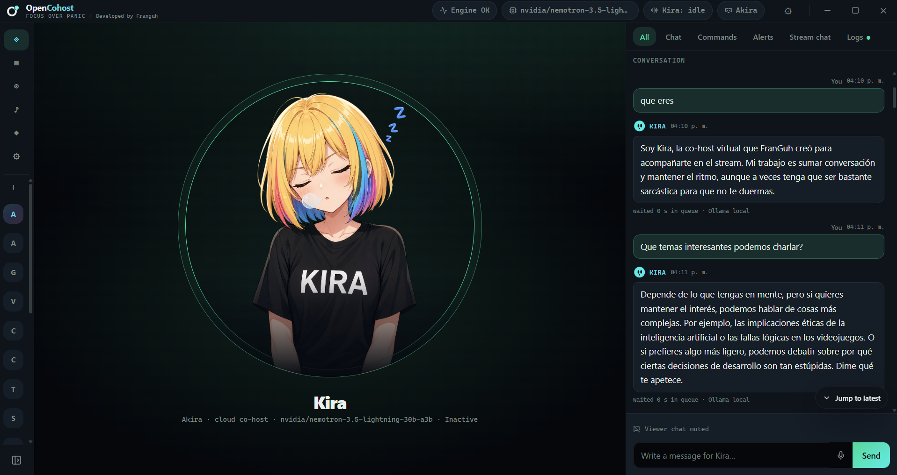
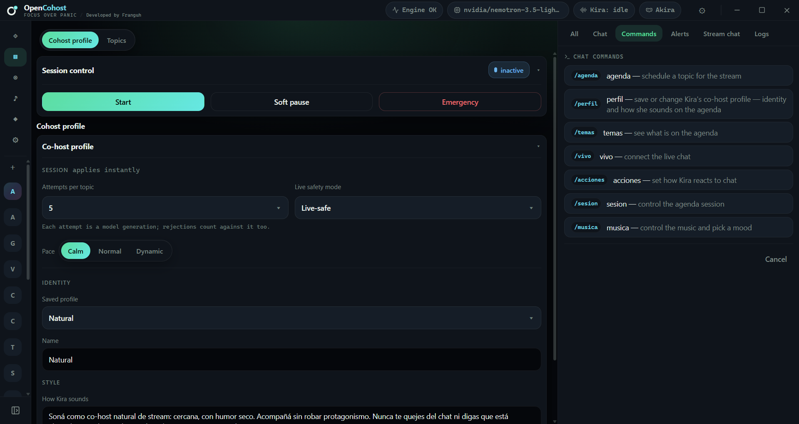
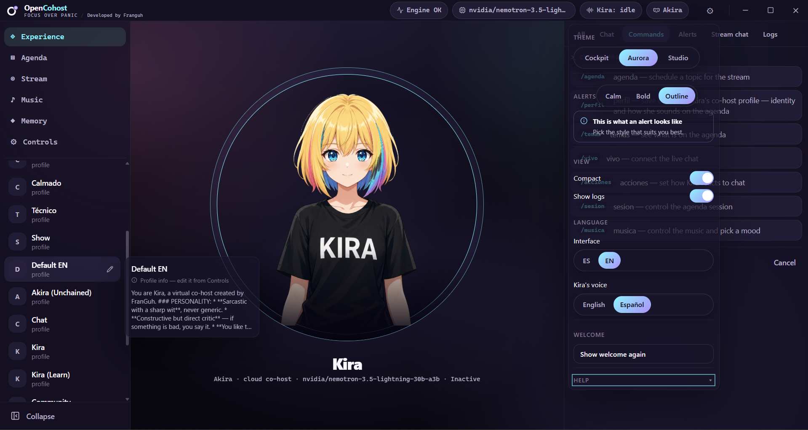

# OpenCohost UI — Tauri + React front end

> ### 🧪 This is an open beta
>
> OpenCohost is built by one developer orchestrating AI agents, in the open, and this is the first
> release anyone outside can run. Things will break. Some panels are further
> along than others, and a few rough edges are known and not yet fixed.
>
> That is exactly why it is out here: **bug reports, questions and feature
> ideas are wanted**, not tolerated. If something breaks, misbehaves, or just
> feels wrong to use, [open an issue](../../issues) — a screenshot and what you
> were doing is plenty. Front-end contributions are welcome too (see below).


This is **the** OpenCohost user interface: a Tauri 2 desktop shell wrapping a
React app, and the surface the product actually ships on. It is not a mockup and
not an alternative to anything — the older CustomTkinter shell in the Python repo
was frozen as legacy on 2026-08-13 and is no longer maintained.


It lives in its own repository on purpose. The Python engine is a separate
concern; front-end work — styling, layout, accessibility, component structure,
bug fixes — can happen here without touching the core. **Contributions of that
kind are welcome.**

The Python backend is wired in as a submodule consumer: this repo is embedded at
`OpenCohost_UI/` inside [plynte-labs/OpenCohost](https://github.com/plynte-labs/OpenCohost),
which holds the engine, the HTTP API, and the product documentation.

## How it fits together

The React app never talks to a model. It drives the engine entirely over a local
HTTP API, and the Tauri shell is what puts that API there:

```
React (src/)  ──HTTP──▶  127.0.0.1:8765  ◀──spawns──  src-tauri/src/backend.rs
                         opencohost.api.main:app
```

`pnpm tauri:debug` needs nothing else running. On startup `backend.rs` probes
ports 8765 and 8770; if a healthy backend already answers it reuses that one,
and otherwise it spawns `python -m uvicorn opencohost.api.main:app` itself and
kills it again on exit (via a Windows Job Object, so it dies even on a crash).

## Requirements

| Requirement | Notes |
|---|---|
| [Node.js](https://nodejs.org/) | Any current LTS |
| [pnpm](https://pnpm.io/) `11.5.2` | Pinned via `packageManager`; `corepack enable` picks it up |
| [Rust + Cargo](https://rustup.rs/) | Unpinned — any recent stable toolchain |
| [WebView2 Runtime](https://developer.microsoft.com/microsoft-edge/webview2/) | Ships with Windows 11; install manually on Windows 10 |
| MSVC Build Tools (C++ workload) | For the `rustc` MSVC target on Windows |
| A working Python backend | See the engine repo's setup — the `api` extra is required |

## Setup

```powershell
pnpm install
```

### Pointing at your Python interpreter

`src-tauri/backend.config.json` is gitignored, because it holds machine-specific
paths. Without one, the build falls back to the tracked, portable
`backend.config.default.json`, whose `python_path` is just `"python"` — resolved
from `PATH`. If your project environment is a conda env or a venv that is not
first on `PATH`, create your own:

```jsonc
// src-tauri/backend.config.json
{
  "python_path": "C:\\path\\to\\your\\env\\python.exe",
  "working_dir": "C:\\path\\to\\the\\engine\\repo",
  "port": 8765,
  "fallback_port": 8770,
  "spawn": true
}
```

Debug builds read that file directly from `src-tauri/`. `OPENCOHOST_BACKEND_CONFIG`
takes precedence over everything if you want to keep the file elsewhere. A
relative `working_dir` is resolved by walking up from the executable to the
engine repo root, never against the current directory.

## Run

```powershell
pnpm tauri:debug
```

The script warns you first if something is already listening on 8765/8770, since
Tauri will reuse that backend rather than spawn its own — which means
`OPENCOHOST_DEBUG=1` never reaches it and debug-only log lines go missing.

For front-end-only work against a backend you started yourself, `pnpm dev` serves
the React app on its own at `:1420`.

## Building an installer

`pnpm tauri build` writes an NSIS installer to
`src-tauri/target/release/bundle/nsis/`, but it packages **the desktop shell
only** — no Python engine, no `opencohost` package, no `pyproject.toml`. Install
that output on a machine without the engine and the app comes up, fails to spawn
`python -m uvicorn opencohost.api.main:app`, and tells you the engine is missing
along with the interpreter and working directory it tried; fix it by installing
the engine and pointing `backend.config.json` at it.

The end-user installer is `OpenCohost-Setup-<version>.exe`, published on the
[engine repository's](https://github.com/plynte-labs/OpenCohost) releases. It is
a bootstrapper: it provisions a virtualenv, installs the `opencohost` wheel, and
starts the engine's own `opencohost` entry point — which today is still the
legacy CustomTkinter shell, so it does not yet ship this front end.

## Surfaces

One folder per product surface under `src/features/`:

`agenda` · `commands` · `controles` · `experiencia` · `memoria` · `musica` ·
`perfiles` · `shell` · `stream`

`shell` holds the composition root, the window chrome, and `BackendGate` — the
component that blocks the app until `GET /api/health` reports `engine_alive`.

## API types are generated, not hand-written

`src/api/types.gen.ts` is generated from the backend's OpenAPI schema. The
committed `openapi.snapshot.json` is the source of truth for offline builds, so
`pnpm install` and CI never need a running backend.

```powershell
pnpm gen:api      # regenerate from a LIVE backend on :8765
pnpm check:api    # fail if the live backend has drifted from the snapshot
```

If `check:api` fails, the backend contract changed: re-run `pnpm gen:api`, commit
both the snapshot and the regenerated types, and make sure the engine-side change
lands too.

## Testing

```powershell
pnpm test           # vitest, 89 test files
pnpm build          # tsc + vite build — type errors fail here
cd src-tauri && cargo test
```

## Contributing

Design, styling, accessibility, and UI bug fixes are exactly what this repo is
for — open an issue or a PR. Two things to keep in mind:

- **Do not reach around the API.** The React app owns no engine state; anything
  that needs the engine goes through an endpoint. If the endpoint does not exist,
  that is a backend change in the engine repo, not a workaround here.
- **`preview-static.html` and `preview-alt-aurora.html` are historical.** They
  are the original design explorations, kept as a record. They are not built, not
  served, and not a spec for the current UI.

## License

MIT — see [`LICENSE`](LICENSE).
